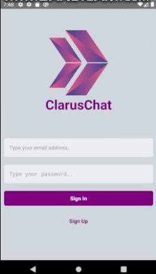
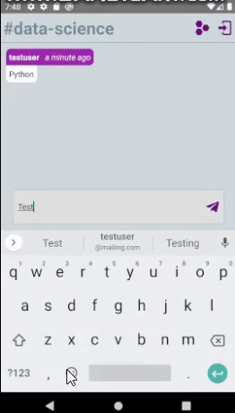
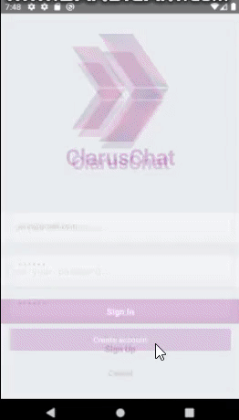
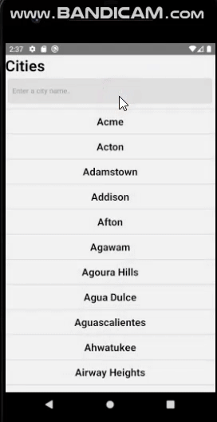
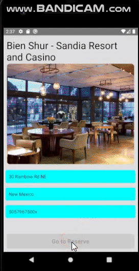

  

<h1 align="center">
  Index of React Native Projects
</h1>
 

| Project Code        | Name           | Repo Link  | Overwiev  |
| ------------------- |:--------------:| ----------:| :--------: |
| RN_10           | Quiz Game App | [Repository](https://github.com/raymondaksu/Project-019-Quiz-Game-App-RN_10)  |  |
| RN_09           | Chat App (Firebase) | [Repository](https://github.com/raymondaksu/Project-018-Chat-App-With-Firebase-RN_09)  |    |
| RN_08           | Restaurant Search App (Google Maps) | [Repository](https://github.com/raymondaksu/Project-017-Restaurant-Search-App-With-GoogleMaps-RN_08)  |  |
| RN_07           | Job Search App  | [Repository](https://github.com/raymondaksu/Project-016-Job-Search-App-RN_07)  |  |
| RN_06           | City Yelp App  | [Repository](https://github.com/raymondaksu/Project-015-City-Yelp-App-RN_06)  |   |
| RN_05           | Double Click to Like  | [Repository](https://github.com/raymondaksu/Project-014-ClickDouble-For-Like-RN_05)  |  |
| RN_04           | Shopping-Page  | [Repository](https://github.com/raymondaksu/Project-013-Shopping-Page-RN_04)  |  |
| RN_03           | To Do App  | [Repository](https://github.com/raymondaksu/Project-012-TO-DO-App-RN_03)  | [Snack Expo](https://snack.expo.io/@rookie_developer/project-012-to-do-app-rn_03)|
| RN_02           | Login Page | [Repository](https://github.com/raymondaksu/Project-011-Login-Page-RN_02)  | [Snack Expo](https://snack.expo.io/@rookie_developer/project-011-login-page_rn_02) |
| RN_01           | News Page  | [Repository](https://github.com/raymondaksu/Project-010-News-Page-RN_01)  | [mp4 overview](https://raymondaksu.github.io/Project-010-News-Page-RN_01/RN-010-News-Page_record.mp4) |
